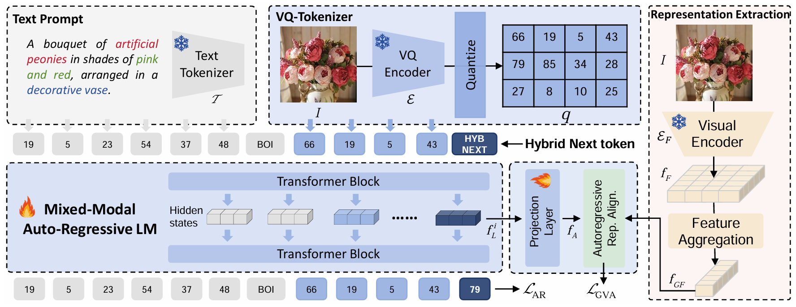
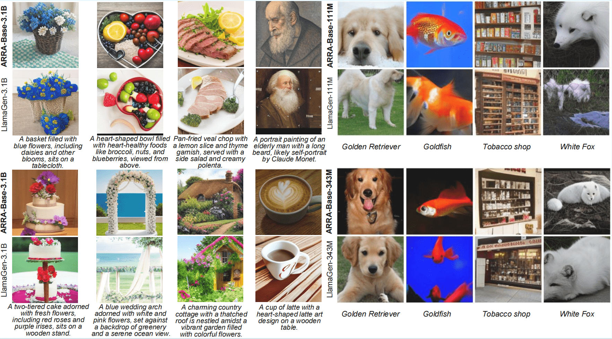
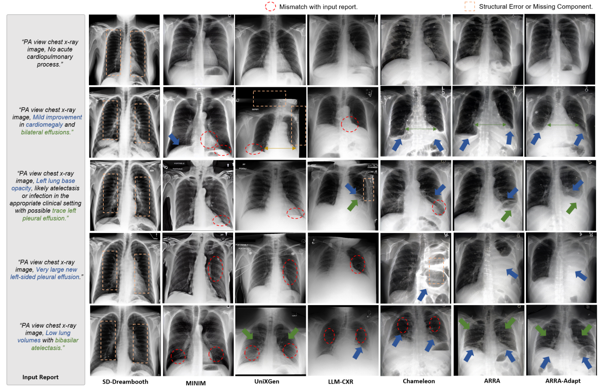

# Unleashing the Potential of Large Language Models for Text-to-Image Generation through Autoregressive Representation Alignment
<div align="center">
  
[](https://arxiv.org/abs/2503.07334)&nbsp;

</div>

## 🌟 Overview
**ARRA** (Autoregressive Representation Alignment) is a novel training framework that enables autoregressive LLMs to perform high-quality text-to-image generation **without architectural modifications**. The key designs include:
- A global visual alignment loss
- The innovative `<HYBNEXT>` token (enforcing dual local-global constraints)

### ARRA Framework

### Results

### Results for X-rays generation



## 🚀 Demo
1. Download pretrained models

2. Run inference:
```
python3 arra/inference_vision.py
```
The generated images will be saved to `./generated_image`.


## ⚡ Training process
### 1. Pre-tokenization
For efficiency considerations, the multi-modal datasets are pre-tokenized into sequences of token ids. This leads to significantly faster training.

### Run Tokenization

This stage tokenizes each data point, consisting of interleaved image and text, into a single sequence of integer tokens. After tokenization, the sequence is saved to disk for trainining-time usage. Together with the saved tokens, a json-formatted record file is also generated for indexing all the saved token files. For faster tokenization, you may use multiple GPUs and dispatch different subsets of data to them.

#### Command:

```bash
for i in {0..7}
do
  export CUDA_VISIBLE_DEVICES=${i}
  python -u pre_tokenize/pre_tokenize_new.py \
  --splits=8 \
  --rank=${i} \
  --in_filename /path/to/in_filename.json \
  --out_dir /path/to/out_dir \
  --target_size 512 &> ${i}.log &
done
```

#### Format of Input File:

`in_filename` is expected to be a json file with the following format:
```python
[
    {...},
    {...},
    {
        "conversations": [
            {
                "from": "human",
                "value": "AP view chest x-ray image, Nasogastric tube is coiled in the stomach."
            },
            {
                "from": "gpt",
                "value": "<|image|>"
            }
        ],
        "image": [
            "./datasets/MIMIC-CXR/files/p19/p19023118/s50489739/da2a33b1-a3e756c6-9aec59ef-dcc2bfe8-0e872a6f.jpg"
        ]
    },
    {
        "conversations": [
            {
                "from": "human",
                "value": "AP view chest x-ray image, No acute cardiopulmonary process.  No evidence of free air beneath the diaphragms."
            },
            {
                "from": "gpt",
                "value": "<|image|>"
            }
        ],
        "image": [
            "./datasets/MIMIC-CXR/files/p19/p19023118/s50688363/2d8ff122-9033f698-4190575b-d5de4716-f11842b9.jpg"
        ]
    },
    {...},
    {...}
]
```

*Rules:*

1. The file is a list of dictionaries, and each dictionary represents a data point
2. Each dictionary contains the key "conversations"
3. If the conversation involves image(s), the data point should also contain the `image` key, otherwise the `image` key can be omitted
4. The location of each image should be explicitly specified in the conversation using the `<|image|>` symbol
   1. Apparently, the number of occurrences of the `<|image|>` symbol should be equal to the number of images in the `image` key


#### How to adapt to your own format:

If you have your own data with a different format, you can easily adapt the code to deal with it by modifying the `pre_tokenize.py` file.
We have prepared the space, which is in `ItemProcessor.process_item`, for adding your logic that converts data points of your own format into the standard format.

### Concat Records

After tokenization, You need to concat the record files generated by different processes (GPUs) into one single record file.
**Note that we use the term "record file" to refer to the meta file that contains the information of all the saved token files,
which is different from the token files themselves.**

```bash
python -u pre_tokenize/concat_record.py \
--sub_record_dir /path/to/out_dir \
--save_path /path/to/out_dir/record.json
```

### External Representation Extraction
First you need to download the corresponding foundation model from huggingface ([BioMedCLIP](https://huggingface.co/chuhac/BiomedCLIP-vit-bert-hf),
[CLIP-L](https://huggingface.co/openai/clip-vit-large-patch14),
[MedSAM](https://huggingface.co/wanglab/medsam-vit-base)).

Next you can extract external representation for training:
```bash
python pre_tokenize/pre_biomedclip_feature.py
```
or
```bash
python pre_tokenize/pre_medsam_feature.py
```

### 2. Training

#### Command:
We provide an example experiment scripts [scrpits/7B.sh](arra/scrpits/7B.sh) for training the 7B model.

```bash
bash scrpits/7B.sh
```


#### About the `--data_config` argument:
The ``--data_config`` argument should point to a `*.yaml` file, which is a meta file that gathers one or multiple record files.
In other words, you may pre-tokenize multiple datasets independently and list the record files in the same data config file
for joint training.

## 🙏 Acknowledgement
This code is build on the following repositories:
[https://github.com/Alpha-VLLM/Lumina-mGPT](https://github.com/Alpha-VLLM/Lumina-mGPT).

## 📚 BibTeX
```bibtex
@article{xie2025unleashing,
  title={Unleashing the Potential of Large Language Models for Text-to-Image Generation through Autoregressive Representation Alignment},
  author={Xie, Xing and Liu, Jiawei and Lin, Ziyue and Fan, Huijie and Han, Zhi and Tang, Yandong and Qu, Liangqiong},
  journal={arXiv preprint arXiv:2503.07334},
  year={2025}
}
